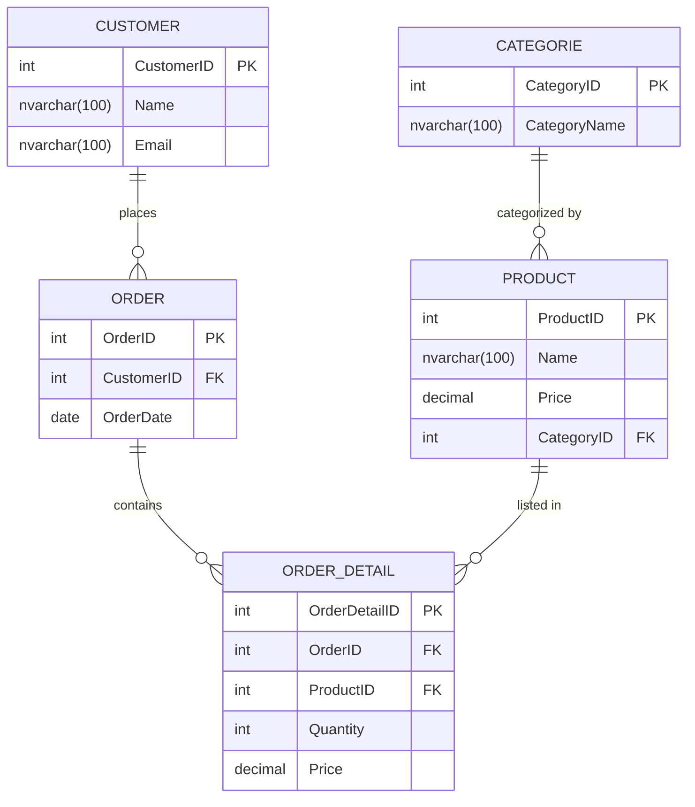
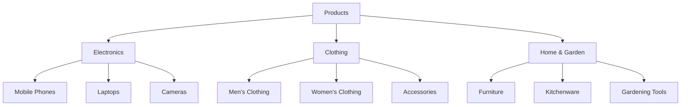

# D1E4 - Simple e-commerce DB

## Key concepts and objectives

This block prepares the realization of a real DB on MS-SQL server. This is the physical planning part only, we will create the database later. 

- **Database Object naming conventions**
- **Data types**: Defines the kind of data that can be stored in a column (e.g., integer, varchar, date).
- **Relationships**:
  - **One-to-One**: Each record in one table is related to one record in another table.
  - **One-to-Many**: A single record in one table can be associated with multiple records in another table.
  - **Many-to-Many**: Records in one table can relate to multiple records in another table and vice versa, often implemented using a junction table.

## Naming conventions

As a first step we need to decide how to name DB objects:

| Naming Convention                    | Example            | Description                                                  |
| ------------------------------------ | ------------------ | ------------------------------------------------------------ |
| Camel Case                           | `myVariableName`   | Starts with a lowercase letter; each new word starts uppercase. |
| Pascal Case<br />aka. UpperCamelCase | `MyVariableName`   | Each word starts with an uppercase letter, no spaces or underscores. |
| Snake Case                           | `my_variable_name` | Words are all lowercase, separated by underscores.           |
| Kebab Case                           | `my-variable-name` | Words are all lowercase, separated by hyphens (usually in URLs). |
| Upper Snake Case                     | `MY_VARIABLE_NAME` | Words are all uppercase, separated by underscores.           |
| (Dot Notation)                       | `my.variable.name` | Words are lowercase and separated by dots (often used in config files). |
| (Hungarian Notation)                 | `strMyVariable`    | Prefix represents the type (e.g., `str` for string, `int` for integer). |
| (Train Case)                         | `My-Variable-Name` | Each word starts with an uppercase letter, separated by hyphens (less common). |
| Screaming Kebab Case                 | `MY-VARIABLE-NAME` | All uppercase, words separated by hyphens (rarely used).     |

We pick `Upper Snake Case` for table names and `Pascal Case` for the field names.

> [!IMPORTANT]
> Use *Singular* for table names: `User`, `Product`, `Order`. Most teams prefer singular names to represent a single entity. A consistent and clear convention will make it easier for future developers or database administrators to understand the data structure.

## MS-SQL types

| Data type            | **Value set**                                                |
| -------------------- | ------------------------------------------------------------ |
| `bigint`             | Ranges  from -9,223,372,036,854,775,808 to 9,223,372,036,854,775,807. |
| `int`                | Ranges  from -2,147,483,648 to 2,147,483,647.                |
| `smallint`           | Ranges  from -32,768 to 32,767.                              |
| `tinyint`            | Ranges  from 0 to 255.                                       |
| `decimal/numeric`    | Represents  decimal fractions, for example, 123.45 or -987.654. |
| `float/real`         | Represents  floating-point numbers, such as 3.14 or -0.001.  |
| `money/smallmoney`   | Represents  monetary values, like 123.45 or -987.65.         |
| `char/varchar`       | Represents  ASCII character strings, e.g., ‘Hello’ or ‘World’. |
| `nchar/nvarchar`     | Represents  Unicode character strings, e.g., ‘Árvíztűrő tükörfúrógép’ or ‘ОТП Лизинг’. |
| `datetime/datetime2` | Represents  a combination of date and time, e.g., ‘2024-05-22 14:30:00’ or ‘2024-05-22T14:30:00’. |
| `date`               | Represents  only the date, e.g., ‘2024-05-22’.               |
| `time`               | Represents  only the time, e.g., ‘14:30:00’.                 |
| `bit`                | Represents  logical values (true or false).                  |
| `binary/varbinary`   | Represents  binary data, such as images or files.            |
| `uniqueidentifier`   | Represents  unique identifiers, e.g., ‘6F9619FF-8B86-D011-B42D-00C04FC964FF’ |

## Fun Fact

The phrase *"The quick brown fox jumps over the lazy dog"*—a classic pangram containing every letter of the English alphabet—has long been used for typing practice, font displays, and testing devices like typewriters and keyboards. It was designed to allow people to see every letter in context quickly.

he quick brown fox jumps over the lazy dog 1234567890” was the first official message sent over the Washington-Moscow Hotline, connecting the U.S. and the Soviet Union. This historic test message was transmitted on August 30, 1963, following the Cuban Missile Crisis, which underscored the urgent need for quick, direct communication between the two superpowers to reduce nuclear tensions. Designed to ensure that the teletype system could correctly transmit all English letters and numbers, this message marked a breakthrough in Cold War diplomacy, creating a secure, reliable link between the two countries’ leadership

The hotline was a teleprinter link, not a phone as often depicted in movies, and was used for carefully selected messages that were translated and encrypted before sending. Initially, each side performed regular tests, often using innocuous literary excerpts or news. It became a tool for crisis communication, providing a direct line to prevent misunderstandings during several tense moments over the years, including the Six-Day War and the Yom Kippur War

## Building the database

We [https://mermaid.live/](https://mermaid.live/) use to  edit 

1. **Customers Table**: Contains customer-specific information.
2. **Categories Table**: Contains category-specific information.
3. **Products Table**: Contains product-specific information with a foreign key to categories.
4. **Orders Table**: Contains order-specific information with a foreign key to customers.
5. **OrderDetails Table**: Contains order line items with foreign keys to orders and products.


```
erDiagram
    CATEGORIE {
        int CategoryID PK
        nvarchar(100) CategoryName
    }

    CUSTOMER {
        int CustomerID PK
        nvarchar(100) Name
        nvarchar(100) Email
    }

    ORDER_DETAIL {
        int OrderDetailID PK
        int OrderID FK
        int ProductID FK
        int Quantity
        decimal Price
    }

    ORDER {
        int OrderID PK
        int CustomerID FK
        date OrderDate
    }

    PRODUCT {
        int ProductID PK
        nvarchar(100) Name
        decimal Price
        int CategoryID FK
    }

    CUSTOMER ||--o{ ORDER : "places"
    ORDER ||--o{ ORDER_DETAIL : "contains"
    PRODUCT ||--o{ ORDER_DETAIL : "listed in"
    CATEGORIE ||--o{ PRODUCT : "categorized by"


```



### 

> [!NOTE]
>
> `ORDER_DETALLI` can be named `LINE_ITEM` as well.


## Basic Relationship Notations in Mermaid

The difference between `||--o{` and `||--{` in Mermaid ER diagrams lies in the optionality of the relationship at one end:

1. **`||--o{`**: Represents a **one-to-zero-or-many** relationship.
   - The `||` on the left indicates a mandatory relationship on that end (meaning every instance of the left entity must relate to one or more instances of the right entity).
   - The `o{` on the right indicates an optional relationship (meaning instances of the right entity may or may not relate to any instances of the left entity).
2. **`||--{`**: Represents a **one-to-one-or-many** relationship.
   - The `||` on the left still indicates a mandatory relationship on that end.
   - The `{` on the right now indicates that every instance of the right entity must relate to at least one instance of the left entity (a mandatory relationship), allowing for one or many instances.

### Example in Context

```
mermaidCopy codeerDiagram
    CUSTOMER ||--o{ ORDER : places    %% CUSTOMER must place zero or many ORDERS
    PERSON |--{ PHONE : has    
```

In summary:

- `||--o{` means "one-to-zero-or-many" (the right side is optional).
- `||--{` means "one-to-one-or-many" (the right side is mandatory).
- Each `PERSON` must have at least one `PHONE`.
- Each `PHONE` is associated with exactly one `PERSON`.

## Import Mermaid into draw.io

① Open [draw.io](https://app.diagrams.net/)!

② Create a blank diagram

③ Insert Mermaid diagram width  `Arrange` / `Insert` / `Advanced`/`Mermaid`


## Tasks to be solved individually

🅐 Organize the products into categories in the database as in the following example. The level of the structure is arbitrary, not limited to 3: 



🅑 Track price history of the products!

🅒 Personal data of the customers can change, like salutation on the PhD degree, name on marriage or divorce. Track these changes in the database! 

