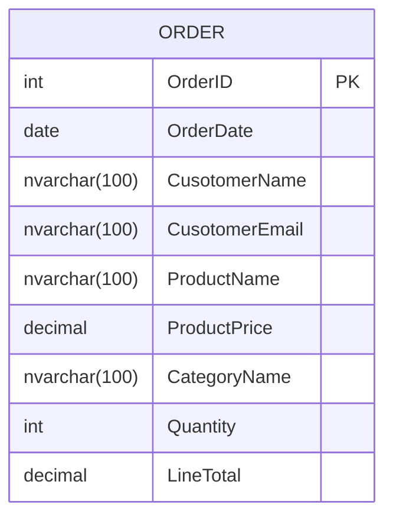
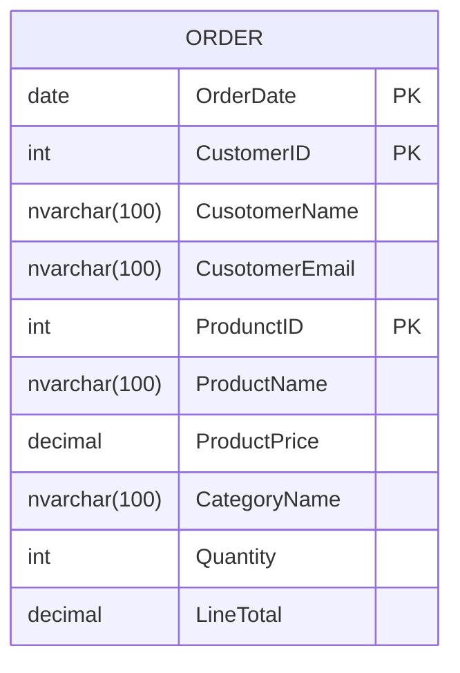
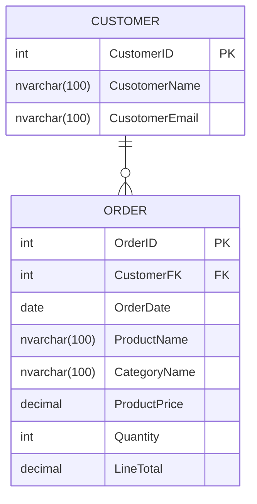
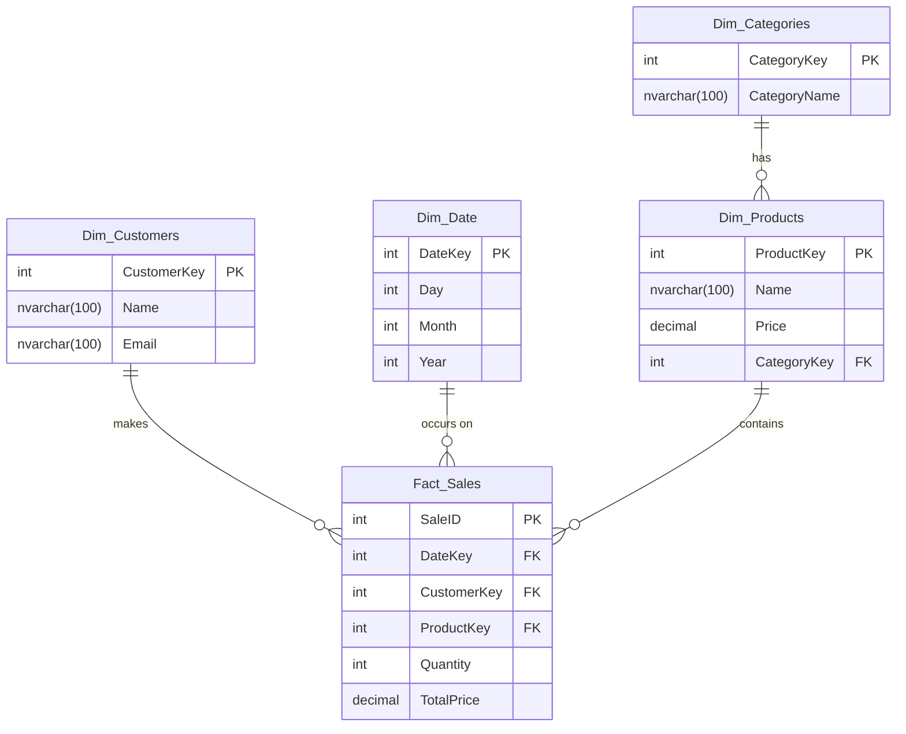

# D2E2 - Normalization

Following <u>normalization</u> principles (such as the normal forms) <u>promotes best practices</u> in database design, which contributes to the overall quality of the database.

> [!IMPORTANT]
> In practice we think in NF3. In practice database design is not carried out trough these steps! Following normalization steps ensures that the database design meets certain criteria. 

## Initial State - NF0

| OrderDate | CustomerName  | CustomerEmail        | ProductName | ProductPrice | CategoryName | Quantity | LineTotal |
| --------- | ------------- | -------------------- | ----------- | ------------ | ------------ | -------- | --------- |
| 9/1/2021  | John Doe      | johndoe@email.com    | Laptop      | 1200.00      | Electronics  | 1        | 1200.00   |
| 9/2/2021  | Jane Smith    | janesmith@email.com  | T-shirt     | 20.00        | Clothing     | 2        | 40.00     |
| 1/10/2022 | Alice Johnson | alicej@example.com   | Smartphone  | 700.00       | Electronics  | 1        | 70.00     |
| 1/11/2022 | Bob Smith     | bobsmith@example.com | Jeans       | 50.00        | Clothing     | 2        | 500.00    |
| 1/12/2022 | Carol Brian   | carolb@example.com   | Backpack    | 70.00        | Clothing     | 1        | 150.00    |
| 1/13/2022 | John Doe      | johndoe@email.com    | Tablet      | 250.00       | Electronics  | 1        | 60.00     |
| 1/13/2022 | John Doe      | johndoe@email.com    | Laptop      | 1200.00      | Electronics  | 1        | 700.00    |
| 1/14/2022 | Jane Smith    | janesmith@email.com  | Headphones  | 150.00       | Electronics  | 1        | 25.00     |
| 1/15/2022 | David Lee     | davidlee@example.com | Sweater     | 60.00        | Clothing     | 3        | 30.00     |
| 1/16/2022 | Emma Watson   | emmaw@example.com    | Charger     | 25.00        | Electronics  | 1        | 30.00     |
| 1/17/2022 | Frank Miller  | frankm@example.com   | Socks       | 10.00        | Clothing     | 2        | 70.00     |

### Issues with NF0

- **Redundancy**: Customer information is repeated for each order.
- **Update Anomaly**: Updating a customer's email would require updating it in every row where the customer appears.
- **Insertion Anomaly**: Adding a new customer without an order might require entering dummy order data.
- **Deletion Anomaly**: Deleting an order might inadvertently delete customer information.


## NF1

### NF1 - Requirements

A table is in First Normal Form if it meets the following criteria:

1. **Atomicity**: Each column contains only atomic (indivisible) values.
2. **Uniqueness**: Each row must be unique.
3. **No Repeating Groups**: There should be no repeating groups or arrays.


### NF1 - Atomicity

A practical example for non-atomic values is a filed containing XML or JSON code. According to Codd's answer to the question it violates NF1:

| ProductKey | Name       | Price   | CategoryKey | HardwareSpecs                                                |
| ---------- | ---------- | ------- | ----------- | ------------------------------------------------------------ |
| 1          | Laptop     | 1200.00 | 1           | `<Hardware><CPU>Intel i7</CPU><RAM>16GB</RAM><Storage>512GB SSD</Storage><Graphics>NVIDIA GTX 1650</Graphics></Hardware>` |
| 2          | Smartphone | 700.00  | 1           | `<Hardware><CPU>Snapdragon 888</CPU><RAM>8GB</RAM><Storage>128GB</Storage><Camera>108MP</Camera></Hardware>` |
| 3          | Tablet     | 250.00  | 1           | `<Hardware><CPU>Apple A14</CPU><RAM>4GB</RAM><Storage>64GB</Storage><Display>10.2 inch</Display></Hardware>` |
| 4          | Headphones | 150.00  | 1           | `<Hardware><Type>Over-Ear</Type><Wireless>Yes</Wireless><BatteryLife>20 hours</BatteryLife><NoiseCancelling>Yes</NoiseCancelling></Hardware>` |

MMSQL can query into XML directly:

```sql
SELECT *
FROM Products
WHERE HardwareSpecs.exist('/Hardware/Wireless[text()="Yes"]') = 1;
```

Splitting Addresses to atomic values can be challenging

### NF1 - Fulfill *uniqueness* requirement

#### Solution #1: simple or single primary key

In other words _single column PK_




#### Solution #2: composite primary key 

In other words _multi-column PK_.




## NF2

To normalize the given table to the Second Normal Form (2NF), we need to ensure that it meets the following criteria:

1. The table must be in the First Normal Form (1NF), which means it should have atomic (indivisible) values and each record should be unique. 
2. All non-key attributes must be fully functionally dependent on the entire primary key, meaning no partial dependency of any column on a part of the composite primary key.


### Case 1:  single-column primary key was added

We are good to go! 

>  [!INFORMATION] 
> A 1NF table is automatically a 2NF table only when the primary key contains only a single column. This is because 2NF rule prohibits partial dependencies, which won't happen if the primary key only contains a single column.

### Case 2:  combined primary key was added

To normalize the given table to the Second Normal Form (2NF), we need to ensure that it meets the following criteria:

- [x] The table must be in the First Normal Form (1NF), which means it should have atomic (indivisible) values and each record should be unique. 

- [ ] All non-key attributes must be fully functionally dependent on the entire primary key, meaning no partial dependency of any column on a part of the composite primary key.

**The given table violates 2NF because it has partial dependencies**. Specifically, 

- `CusotomerName` and `CusotomerEmail` depend only on `CustomerID`, and 
- `ProductName`, `ProductPrice`, and `CategoryName` depend only on `ProdunctID`.

Let's break thigs up:




## Breaking **2NF** (Second Normal Form) in a Relational Database

To understand how 2NF is broken, let's start with the basics. **2NF** requires that a table is already in **1NF** (First Normal Form), and that **all non-key attributes are fully dependent on the entire primary key**. In other words, if the table has a composite primary key, no non-key attribute should depend on just part of that key.

Here’s an example to illustrate **a table that violates 2NF** and why it violates it.

#### Example Table: `OrderDetails` (violating 2NF)

| <u>**OrderID**</u> | <u>**ProductID**</u> | **ProductName** | **UnitPrice** | **Quantity** | **CustomerID** |
| ------------------ | -------------------- | --------------- | ------------- | ------------ | -------------- |
| 101                | 1001                 | TV              | 300           | 2            | C001           |
| 102                | 1002                 | Laptop          | 500           | 1            | C002           |
| 103                | 1003                 | Camera          | 200           | 3            | C003           |
| 101                | 1004                 | Headphones      | 50            | 4            | C001           |
| 102                | 1001                 | TV              | 300           | 1            | C002           |

#### Why this breaks 2NF:

The primary key here is a **composite key** consisting of both `OrderID` and `ProductID`. For the table to be in 2NF, all non-key attributes must depend on **both** `OrderID` and `ProductID` together, but not on just a part of the key. However, this table violates 2NF because:

1. **ProductName** and **UnitPrice** depend only on `ProductID`, not on the entire composite key (`OrderID`, `ProductID`).
2. **CustomerID** depends only on `OrderID`, not on both `OrderID` and `ProductID`.

So, we can see that the non-key attributes are only partially dependent on the primary key components, which violates 2NF.

------

### Corrected Tables to Achieve 2NF

To fix the violation, we need to split the data into multiple tables.

#### `Orders` Table:

| <u>**OrderID**</u> | <u>**CustomerID**</u> |
| ------------------ | --------------------- |
| 101                | C001                  |
| 102                | C002                  |
| 103                | C003                  |

#### `Products` Table:

| <u>**ProductID**</u> | **ProductName** | **UnitPrice** |
| -------------------- | --------------- | ------------- |
| 1001                 | TV              | 300           |
| 1002                 | Laptop          | 500           |
| 1003                 | Camera          | 200           |
| 1004                 | Headphones      | 50            |

#### `OrderDetails` Table (Now in 2NF):

| <u>OrderID</u> | <u>**ProductID**</u> | **Quantity** |
| -------------- | -------------------- | ------------ |
| 101            | 1001                 | 2            |
| 101            | 1004                 | 4            |
| 102            | 1002                 | 1            |
| 102            | 1001                 | 1            |
| 103            | 1003                 | 3            |

------

### Why This Fix Works:

- Now, **all non-key attributes are fully dependent on the whole primary key**.
- In the `OrderDetails` table, `Quantity` is the only non-key attribute, and it depends on both `OrderID` and `ProductID`.
- The `ProductName` and `UnitPrice` were moved to a separate `Products` table, where they only depend on `ProductID`.
- The `CustomerID` was moved to the `Orders` table, where it depends solely on `OrderID`.

This redesign ensures the tables now satisfy 2NF, eliminating partial dependencies.


## NF3

### Requirements

To bring the given database structure to Third Normal Form (3NF), we need to ensure that:

1. The database is in Second Normal Form (2NF).
2. All the attributes are functionally dependent on the primary key, and there are no transitive dependencies.

**In the given schema, the `ORDERS` table has transitive dependencies.** Specifically, 

- `ProductName`, `CategoryName`, and `ProductPrice` depend on `ProductID`, which implies they should be moved to a separate `PRODUCTS` table. 
- Additionally, `CategoryName` depends on `CategoryID`, which implies the need for a `CATEGORIES` table.


### Breaking **3NF** 

#### Example Table: `Employees` (violating 3NF)

| <u>**EmployeeID**</u> | **EmployeeName** | **DepartmentID** | **DepartmentName** | **DepartmentManager** |
| --------------------- | ---------------- | ---------------- | ------------------ | --------------------- |
| 1                     | Alice            | D001             | HR                 | Bob                   |
| 2                     | John             | D002             | Sales              | Carol                 |
| 3                     | Mike             | D001             | HR                 | Bob                   |
| 4                     | Emma             | D003             | IT                 | David                 |

#### Why this breaks 3NF:

- The primary key in this table is `EmployeeID`.

- The non-key attributes are `EmployeeName`, `DepartmentID`, `DepartmentName`, and `DepartmentManager`.

- There’s a 

  transitive dependency

   between `DepartmentName`, and `DepartmentManager`

   Specifically:

  - `DepartmentName` depends on `DepartmentID`.
  - `DepartmentManager` depends on `DepartmentID`.

In other words, `DepartmentName` and `DepartmentManager` do not depend directly on the `EmployeeID` but instead depend on the `DepartmentID`, which is a violation of 3NF.


### 

Solution  #2: Snow Flake



