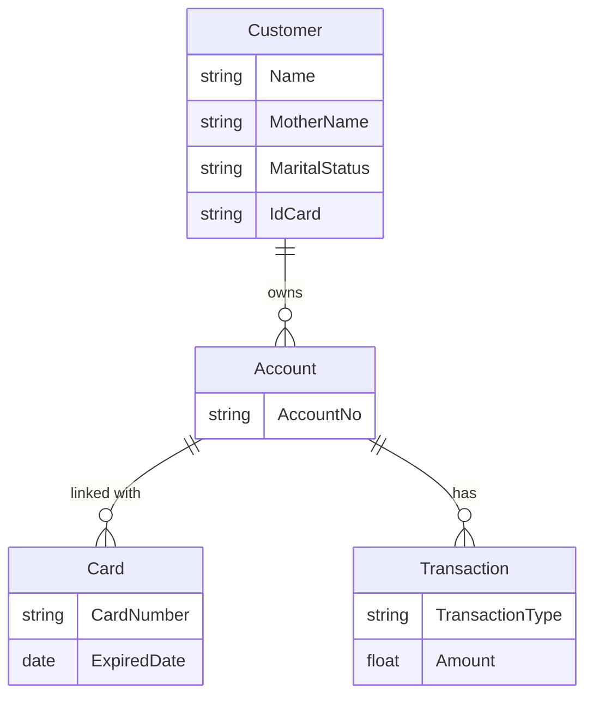

# Entity Relationship Modeling

## Task 1

```mermaid
erDiagram
    Customer {
        string Name
        string MotherName
        string MaritalStatus
        string IdCard
    }

    Account {
        string AccountNo
    }

    Card {
        string CardNumber
        date ExpiredDate
    }

    Transaction {
        string TransactionType
        float Amount
    }

    Customer ||--o{ Account : "owns"
    Account ||--o{ Card : "linked with"
    Account ||--o{ Transaction : "has"
```