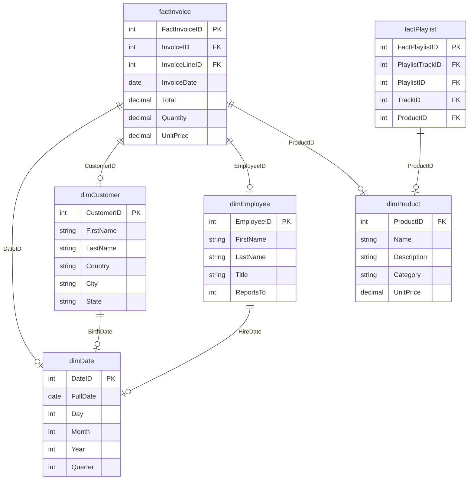
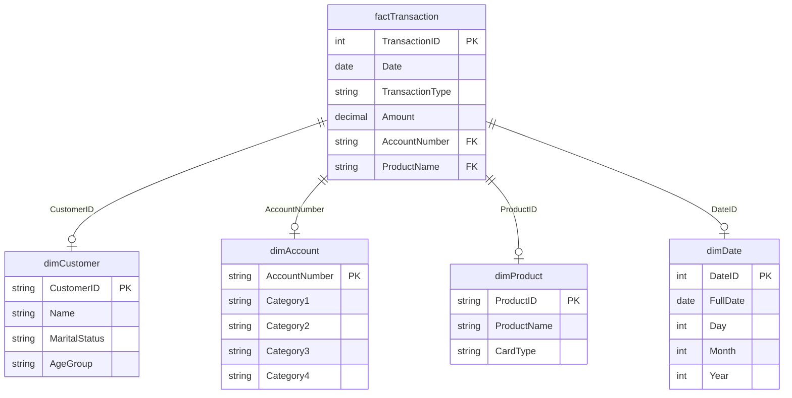

# OLAP vs OLTP

## Task 1:

```mermaid
erDiagram
    %% Fact Tables
    factInvoice {
        int FactInvoiceID PK
        int InvoiceID FK
        int InvoiceLineID FK
        date InvoiceDate
        decimal Total
        decimal Quantity
        decimal UnitPrice
    }

    factPlaylist {
        int FactPlaylistID PK
        int PlaylistTrackID FK
        int PlaylistID FK
        int TrackID FK
        int ProductID FK
    }

    %% Dimension Tables
    dimDate {
        int DateID PK
        date FullDate
        int Day
        int Month
        int Year
        int Quarter
    }

    dimEmployee {
        int EmployeeID PK
        string FirstName
        string LastName
        string Title
        int ReportsTo
    }

    dimCustomer {
        int CustomerID PK
        string FirstName
        string LastName
        string Country
        string City
        string State
    }

    dimProduct {
        int ProductID PK
        string Name
        string Description
        string Category
        decimal UnitPrice
    }

    %% Relationships
    factInvoice ||--o| dimDate : "DateID"
    factInvoice ||--o| dimCustomer : "CustomerID"
    factInvoice ||--o| dimEmployee : "EmployeeID"
    factInvoice ||--o| dimProduct : "ProductID"

    factPlaylist ||--o| dimProduct : "ProductID"

    %% Additional Relationships for OLAP Analysis
    dimEmployee ||--o| dimDate : "HireDate"
    dimCustomer ||--o| dimDate : "BirthDate"
```

## Task 2:

```mermaid
erDiagram
    %% Fact Table
    factTransaction {
        int TransactionID PK
        date Date
        string TransactionType
        decimal Amount
        string AccountNumber FK
        string ProductName FK
    }

    %% Dimension Tables
    dimCustomer {
        string CustomerID PK
        string Name
        string MaritalStatus
        string AgeGroup
    }

    dimAccount {
        string AccountNumber PK
        string Category1
        string Category2
        string Category3
        string Category4
    }

    dimProduct {
        string ProductID PK
        string ProductName
        string CardType
    }

    dimDate {
        int DateID PK
        date FullDate
        int Day
        int Month
        int Year
    }

    %% Relationships
    factTransaction ||--o| dimCustomer : "CustomerID"
    factTransaction ||--o| dimAccount : "AccountNumber"
    factTransaction ||--o| dimProduct : "ProductID"
    factTransaction ||--o| dimDate : "DateID"
```